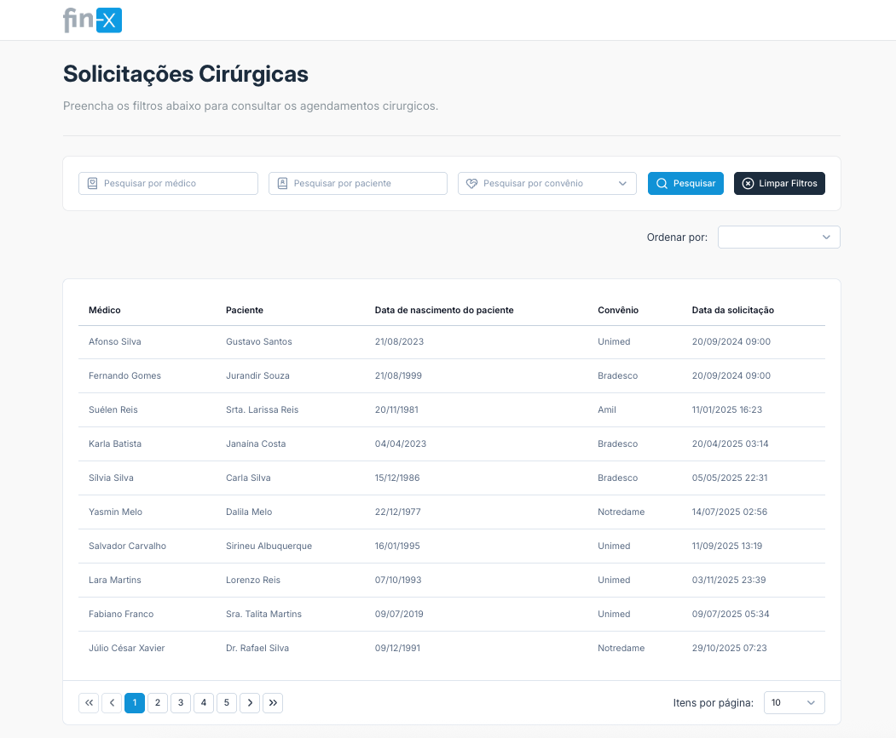

## Objetivo

O projeto consiste em uma tela de listagem de solicitações cirúrgicas, a tela deve trazer uma UX otimizada para o usuário final visto que em outras telas da aplicação o mesmo teve problemas com a falta de filtros e lentidão na hora da exibição dos dados.

## Arquitetura

Visto se tratar de uma aplicação simples e provavelmente autenticada, optei por utilizar o padrão de SPA no projeto, com uma separação simples de camadas e responsabilidades visto que a aplicação consiste em apenas uma feature.

Estrutura de pastas:

```bash
├── src/
│   ├── api/         # Instância e configuração do axios
│   ├── assets/      # Imagens, css, ícones e fontes da aplicação
│   ├── components/  # Componentes reutilizáveis, no caso da nossa aplicação por ser pequena e estarmos usando o NuxtUI, os componentes da feature principal ficam nesta pasta
│   ├── composables/ # Hooks que compõe a lógica da aplicação, dado o tamanho da aplicação, os composables da feature principal ficam nesta pasta (useSearch, etc)
│   ├── constants/   # Constantes da aplicação (ex: convênios, etc)
│   ├── dtos/        # Tipagens e definições das respostas da API
│   ├── mappers/     # Transformação de dados entre camadas (DTO → Model)
│   ├── models/      # Modelos de dados da aplicação
│   ├── views/       # Telas associadas às rotas
│   ├── main.ts      # Ponto de entrada da aplicação
│   └── App.vue      # Componente raiz da aplicação
```

## Bibliotecas e ferramentas

- **Vue 3 + Vite**: Escolha por simplicidade, performance e rapidez no setup, o Vue nos traz uma estrutura pronta e facilidade na montagem de componentes e o vite além de integrar muito bem com Vue, traz uma performance incrível no build e hot-reload.
- **Vue Router**: Solução oficial de roteamento para Vue.js, permite a criação de diferentes rotas e facilidade na aplicação de autenticação e autorização em rotas futuras.
- **Nuxt UI**: Utilização de um Design System pronto, além de trazer uma grande variedade de componentes pronto para uso, o Nuxt UI nos traz uma padronização visual e de UX para a aplicação, também nos oferece uma ótima api para customização dos componentes, podendo se adequar muito bem à mudanças no design system.
- **MSW (Mock Service Worker)**: Simulação realista de chamadas HTTP, permitindo testar cenários de lentidão e erros sem dependência de backend, com essa biblioteca não precisamos mockar o axios diretamente nos testes.
- **Vitest + Vue Test Utils**: Testes de comportamento dos componentes e fluxos de busca, o vitest é uma ferramenta moderna que integra muito bem o vite e nos traz uma API 100% compátivel com Jest.
- **ESLint + Prettier**: Manutenção da qualidade e padronização do código, garantindo o mesmo padrão em todo o projeto e evitando problemas comuns de sintaxe e estilo.

## Decisões de UX/UI



- Realizamos uma simulação de lentidão no backend para simular um ambiente lento no front-end.
- Todos os filtros necessários foram implementados na tela principal, permitindo ao usuário refinar sua busca de forma eficiente, e não sendo necessário que o mesmo abra algum dialog para filtros avançados, visando a facilidade e rapidez na aplicação dos filtros.
- A busca é realizada explicitamente através do botão "Pesquisar", evitando chamadas desnecessárias ao backend a cada digitação, visto que temos um possível problema de lentidão no backend.
- Também trouxemos ao fim da tabela a possibilidade do usuário selecionar quantos itens deseja visualizar por página, melhorando a experiência e permitindo que o usuário mostre menos itens assim melhorando a velocidade de resposta do backend.
- Também temos um filtro secundário para que o usuário ordene os resultados por data de solicitação.
- Exibimos um skeleton no primeiro carregamento da página, melhorando a percepção de performance do usuário.
- Após o primeiro carregamento, sempre exibimos os resultados da tabela e aplicamos um loading overlay na tabela, para que a tela nunca fique sem dados, melhorando a experiência do usuário.
- Ao realizarmos uma filtragem ou alteração na paginção, desabilitamos todos os inputs e botões da tela, para evitar múltiplas requisições simultâneas e garantir que o usuário aguarde o carregamento dos dados.
